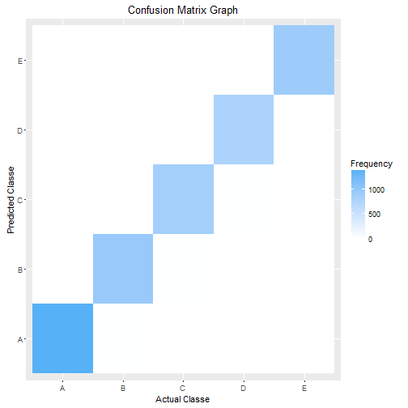
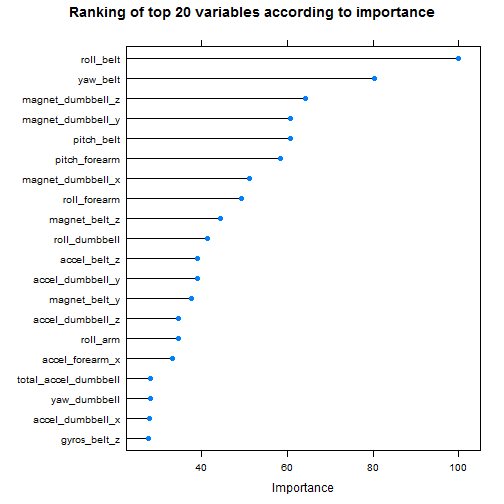
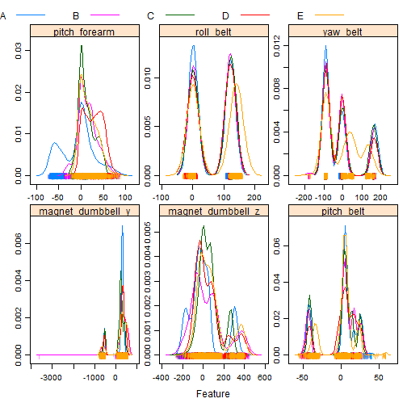

##Human Activity Recognition

###Background

Using devices such as Jawbone Up, Nike FuelBand, and Fitbit it is now possible to collect a large amount of data about personal activity relatively inexpensively. These type of devices are part of the quantified self movement - a group of enthusiasts who take measurements about themselves regularly to improve their health, to find patterns in their behavior, or because they are tech geeks. One thing that people regularly do is quantify how much of a particular activity they do, but they rarely quantify how well they do it. In this project, your goal will be to use data from accelerometers on the belt, forearm, arm, and dumbell of 6 participants. They were asked to perform barbell lifts correctly and incorrectly in 5 different ways. More information is available from the website here: http://groupware.les.inf.puc-rio.br/har (see the section on the Weight Lifting Exercise Dataset). 

In this project, I uses a set of training data to establish a machine learning model. This was used to predict the manner in which exercise was performed in 20 set of new data (test data).

###Loading data 


```r
library(caret)
library(gbm)
training <- read.csv("pml-training.csv")
testing <- read.csv("pml-testing.csv")
```

###Cleaning data

Remove all columns with NA values.

```r
training <- training[, colSums(is.na(training))==0]
testing <- testing[, colSums(is.na(testing))==0]
```

Remove columns 'x', 'user_name', 'timestamps', data. In testing data, the 'problem_id' column was also removed.


```r
training <- training[,-c(1,2,3,4,5,6,7)]
testing <- testing[,-c(1,2,3,4,5,6,7,60)]
```

Remove from training set all columns with NA values in test data set. Add back the column "classe".


```r
training2 <- training[, names(testing)]
training2[,"classe"] <- training$classe
```

Convert all "factor"" data to the "numeric" type.


```r
indx <- sapply(training2[,-53], is.factor)
training2[indx] <- lapply(training2[indx], function(x) as.numeric(as.factor(x)))
indx2 <- sapply(testing, is.factor)
testing[indx2] <- lapply(testing[indx2], function(x) as.numeric(as.factor(x)))
```

###Data partition

To evaluate out-of-sample error, I divided the training data into two subsets, train1 and train2, at 75% and 25%, respectively. I expect the out-of-sample error to be low, since the training data set is relatively large.


```r
inTrain <- createDataPartition(training2$classe, p=0.75, list=FALSE)
train1 = training2[inTrain,]
train2 = training2[-inTrain,]
```

###Building machine learning models

I built 6 models with the {caret} package, using train1 as training data. I used a 5-fold cross validation.


```r
models<-list()
control<-trainControl(method="cv", 5)
```


```r
models[["ctree"]] <- train(classe ~ ., data = train1, method = "ctree", trControl = control)
```


```r
models[["gbm"]] <- train(classe ~ ., data = train1, method = "gbm", trControl = control, verbose=FALSE)
```


```r
models[["lda"]] <- train(classe ~ ., data = train1, method = "lda", trControl = control)
```


```r
models[["svm"]] <- train(classe ~ ., data = train1, method = "svmLinear", trControl = control)
```


```r
models[["rpart"]] <- train(classe ~ ., data = train1, method = "rpart", trControl = control)
```


```r
models[["rf"]] <- train(classe ~ ., data = train1, method = "rf", trControl = control)
```

To determine accuracy of these models, I tested them against the train2 data set.


```r
results <- data.frame(model = names(models), accuracy = NA)
```


```r
library(caret)
for (i in seq_along(models)) {
  pred <- predict(models[[i]], newdata=train2[,-53]) 
  results[i, 2]<- postResample(pred, train2[,53])[1] 
}
print(arrange(results, desc(accuracy))) 
```

```
##   model  accuracy
## 1    rf 0.9924551
## 2   gbm 0.9616639
## 3 ctree 0.8964111
## 4   svm 0.7838499
## 5   lda 0.6969821
## 6 rpart 0.5000000
```

As show above, the best model is Random Forest, with an accuracy is >0.99, and therefore, I expect the out-of-sample error to be <1%. The accuracy of the Generalized Boosted Regression Model (gbm) is also high (>0.95). Accuracy of Conditional Inference Trees (ctree), Support Vector Machines (svm) and Linear Discriminant Analysis (lda) model are ~0.7 or above. Accuracy of Recursive Partitioning and Regression Trees (rpart) is only ~0.5.

To determine if combining weak models can lead to better accuracy, I built a mode combining ctree, svm, and lda.


```r
combo_df <- data.frame(predict(models[["ctree"]], train2[,-53]), predict(models[["svm"]], train2[,-53]), 
	predict(models[["lda"]], train2[,-53]), classe=train2[,53])
combo_fit <- train(classe ~., method='ctree', data=combo_df)
combo_pred <- predict(combo_fit, combo_df[,-4])
postResample(combo_pred, train2[,53])[1] 
```

```
##  Accuracy 
## 0.8988581
```

Combining three models gave only slight improvement of accuracy (compared to that of ctree model). The combined model is still inferior to both the rf and gbm model.

###Analysis of 'rf' model

Examing confusion matrix in predicting train2 data using rf model:


```r
cm<-confusionMatrix(train2[,53], predict(models[["rf"]], newdata=train2[,-53]))
cm
```

```
## Confusion Matrix and Statistics
## 
##           Reference
## Prediction    A    B    C    D    E
##          A 1395    0    0    0    0
##          B    6  943    0    0    0
##          C    0    5  850    0    0
##          D    0    0   24  780    0
##          E    0    0    0    2  899
## 
## Overall Statistics
##                                           
##                Accuracy : 0.9925          
##                  95% CI : (0.9896, 0.9947)
##     No Information Rate : 0.2857          
##     P-Value [Acc > NIR] : < 2.2e-16       
##                                           
##                   Kappa : 0.9905          
##  Mcnemar's Test P-Value : NA              
## 
## Statistics by Class:
## 
##                      Class: A Class: B Class: C Class: D Class: E
## Sensitivity            0.9957   0.9947   0.9725   0.9974   1.0000
## Specificity            1.0000   0.9985   0.9988   0.9942   0.9995
## Pos Pred Value         1.0000   0.9937   0.9942   0.9701   0.9978
## Neg Pred Value         0.9983   0.9987   0.9941   0.9995   1.0000
## Prevalence             0.2857   0.1933   0.1782   0.1595   0.1833
## Detection Rate         0.2845   0.1923   0.1733   0.1591   0.1833
## Detection Prevalence   0.2845   0.1935   0.1743   0.1639   0.1837
## Balanced Accuracy      0.9979   0.9966   0.9856   0.9958   0.9998
```

Plotting confusion matrix table:


```r
g <- ggplot(as.data.frame(cm$table), aes(x = Prediction, y = Reference, fill = Freq))
g + geom_tile() + scale_fill_gradient(low="white") + scale_x_discrete(name="Actual Classe")  + scale_y_discrete(name="Predicted Classe") + labs(title = "Confusion Matrix Graph", fill="Frequency")
```

 

This model is very good in predicting classe 'A'.

Plotting the top 20 variables according to their importance:


```r
var <- varImp(models[["rf"]])
plot(var, main = "Ranking of top 20 variables according to importance", top = 20)
```

 

As shown above, rool_belt, pitch_forearm, and yaw_belt are the top 3 variables.

Plotting density plot of top 6 variables:


```r
varImp <- var$importance
varImp <- varImp[order(varImp[, 1], decreasing = TRUE),, drop=FALSE]
featurePlot(x = train1[, row.names(varImp)[1:6]],
            y = train1$classe,
            plot = "density",
            scales = list(x = list(relation="free"),
                          y = list(relation="free")),
            adjust = 1.5,
            pch = "|",
            auto.key = list(columns = 6))
```

 

Each classe produces distinct denisity plot using these features.

###Predicting test data and output files for each data

Finally, I used this model to predict the test data.

Predict testing data using rf model:


```r
pred_rf <- predict(models[["rf"]], testing)	
pred_rf
```

```
##  [1] B A B A A E D B A A B C B A E E A B B B
## Levels: A B C D E
```

Predict testing data using gbm model:


```r
pred_gbm <- predict(models[["gbm"]], testing)	
pred_gbm
```

```
##  [1] B A B A A E D B A A B C B A E E A B B B
## Levels: A B C D E
```

Comparing the two models:


```r
library(caret)
confusionMatrix(pred_rf, pred_gbm)
```

```
## Confusion Matrix and Statistics
## 
##           Reference
## Prediction A B C D E
##          A 7 0 0 0 0
##          B 0 8 0 0 0
##          C 0 0 1 0 0
##          D 0 0 0 1 0
##          E 0 0 0 0 3
## 
## Overall Statistics
##                                      
##                Accuracy : 1          
##                  95% CI : (0.8316, 1)
##     No Information Rate : 0.4        
##     P-Value [Acc > NIR] : 1.1e-08    
##                                      
##                   Kappa : 1          
##  Mcnemar's Test P-Value : NA         
## 
## Statistics by Class:
## 
##                      Class: A Class: B Class: C Class: D Class: E
## Sensitivity              1.00      1.0     1.00     1.00     1.00
## Specificity              1.00      1.0     1.00     1.00     1.00
## Pos Pred Value           1.00      1.0     1.00     1.00     1.00
## Neg Pred Value           1.00      1.0     1.00     1.00     1.00
## Prevalence               0.35      0.4     0.05     0.05     0.15
## Detection Rate           0.35      0.4     0.05     0.05     0.15
## Detection Prevalence     0.35      0.4     0.05     0.05     0.15
## Balanced Accuracy        1.00      1.0     1.00     1.00     1.00
```

Both models gave the same predictions for every observations in the test data. All of the predictions are correct.

###Output files for grading

```
answers = pred_rf
pml_write_files = function(x){
     n = length(x)
     for(i in 1:n){
         filename = paste0("problem_id_",i,".txt")
         write.table(x[i],file=filename,quote=FALSE,row.names=FALSE,col.names=FALSE)
     }
 }
pml_write_files(answers)
```


